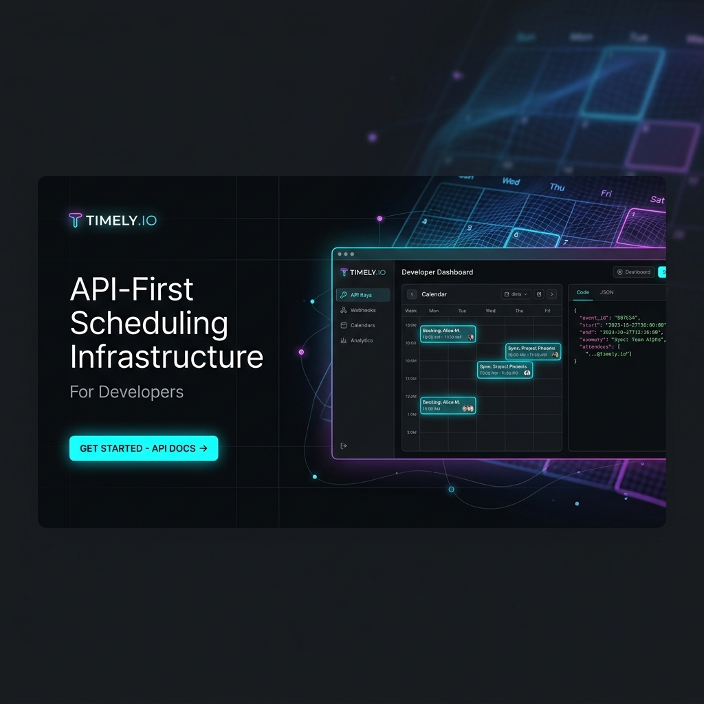

<p align="center">
  
</p>

<div align="center">

# 🗓️ Cal.com Responsive Landing Page

<h3>
  🚀 Lead Frontend Engineer: 
  <a href="https://github.com/sindhavdinesh" title="⚡ Click to view portfolio: Sindhav Dinesh (Frontend Developer) ⚡" style="text-decoration: none;">
    <kbd style="background-color: #111; color: #fff; padding: 4px 10px; border-radius: 6px; cursor: pointer; border: 1px solid #333; font-weight: bold;">
      Sindhav Dinesh
    </kbd>
  </a>
</h3>
<p><i>Frontend Developer</i></p>

---

[](https://html.spec.whatwg.org/)
[](https://www.w3.org/Style/CSS/)
[](https://developer.mozilla.org/en-US/docs/Web/JavaScript)
[](#-responsive-architecture)
[](#)

</div>

---

## 📖 Introduction

This project is a **high-fidelity, pixel-perfect interactive clone** of the official **Cal.com** landing page. It is custom-tailored with advanced responsive behaviors, fluid grids, and dynamic browser interactions. Developed entirely with **semantic HTML5, Vanilla CSS3, and modern ES6 Javascript**, it represents top-tier frontend engineering practices.

> [!IMPORTANT]
> - **Zero Libraries**: Built pure—no Bootstrap, no TailwindCSS. Max performance and complete stylesheet control.
> - **State-of-the-Art CSS**: Uses variable systems, CSS Grid layouts, flexbox distributions, and typography scaling.
> - **Interactive Shells**: Features fully functional Javascript controllers that drive UI events without third-party frameworks.

---

## 🌟 Premium Features

<table width="100%">
  <tr>
    <td width="50%" valign="top">
      <h3>📱 Fluid Responsiveness</h3>
      <p>Seamlessly scales from ultra-wide desktops ($1440\text{px}$) to small mobile screens ($320\text{px}$). Fixed pixel bottlenecks have been entirely eliminated.</p>
    </td>
    <td width="50%" valign="top">
      <h3>🎾 Calendar Tennis Interactive</h3>
      <p>Engages users with real-time availability sync simulator. Selecting list steps changes the interactive terminal graphics dynamically.</p>
    </td>
  </tr>
  <tr>
    <td width="50%" valign="top">
      <h3>💼 Dynamic Pipeline Manager</h3>
      <p>A functional tabs switcher that rotates practitioner details (Doctors, Recruiting panel, Educators, and Advisors) instantly on-click.</p>
    </td>
    <td width="50%" valign="top">
      <h3>🐦 Masonry Tweets Layout</h3>
      <p>Displays a gorgeous social review section that expands with a dynamic "View More" transition, appending entries on the fly.</p>
    </td>
  </tr>
</table>

---

## 🎨 Design System & Responsive Architecture

### 📐 Responsive Grid-Flex Hybrid
Every component leverages modern layout grids for adaptive sizing. The Hero page transitions from a balanced side-by-side grid to a stacked layout seamlessly:

```css
/* Fluid grid container */
.hero {
    display: grid;
    grid-template-columns: 1.1fr 0.9fr;
    gap: 40px;
    align-items: center;
}
```

### 🔠 Fluid Typography Scale
Fonts resize automatically based on the user's viewport width, removing the need for chaotic media queries at every pixel step:
```css
font-size: clamp(2.5rem, 5.2vw, 5.8rem);
```

### 🛠️ Breakpoint Blueprint
Our design scales gracefully across standard device viewports:

| Device Group | Breakpoint | Layout Behavior | UI Optimizations |
| :--- | :--- | :--- | :--- |
| **Widescreen** | `> 1200px` | Side-by-side Dual Column | full headers, hover transitions |
| **Laptops** | `1024px` | Consolidated Columns | scaled gutters, adjusted padding |
| **Tablets** | `768px` | Vertical Stack | hidden desktop search, centered text |
| **Mobile** | `< 480px` | Compact Column | full-width inputs, tap-friendly buttons |

---

## 📂 Codebase Structure

```bash
figma-work/
├── images/                  # High-quality visual assets
│   ├── banner.png           # Premium UI banner image
│   ├── Vector.png           # SVG Logo asset
│   └── [feature-assets]     # Layout illustrations
├── index.html               # Clean, semantic markup document
├── style.css                # Core layout design styles
├── media.css                # Fine-tuned breakpoint media queries
├── script.js                # ES6 JS interactive controller
└── README.md                # Premium project documentation
```

---

## 🚀 Getting Started

1. **Verify Files**: Ensure all assets are placed in the directory structure shown above.
2. **Start the Dev Server**: Spin up a lightweight local server:
   ```bash
   npx http-server -p 8080
   ```
3. **Open in Browser**: Navigate to **[http://localhost:8080](http://localhost:8080)** to test.

---

## 👨‍💻 Meet the Developer

<p>
  <a href="https://github.com/sindhavdinesh" title="⚡ Open Sindhav Dinesh's GitHub Profile ⚡" style="text-decoration: none;">
    <kbd style="background-color: #111; color: #fff; padding: 4px 10px; border-radius: 6px; cursor: pointer; border: 1px solid #333; font-weight: bold;">
      Sindhav Dinesh
    </kbd>
  </a>
  is a Frontend Developer specializing in building high-performance, responsive, and beautiful user interfaces.
</p>

<div align="center">

### **Let's Connect & Build Together**

[](https://github.com/sindhavdinesh)
[](https://linkedin.com/in/sindhavdinesh)
[](https://twitter.com/sindhavdinesh)
[](https://instagram.com/sindhavdinesh)
[](mailto:sindhavdinesh@example.com)

</div>
